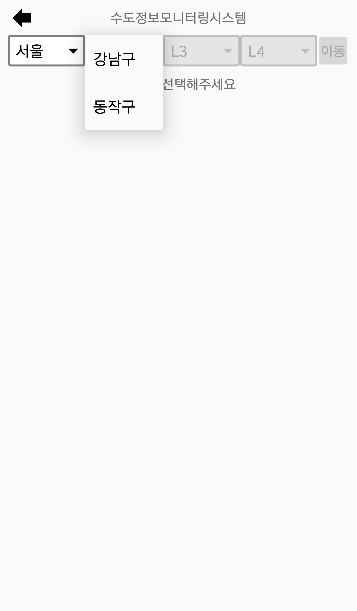
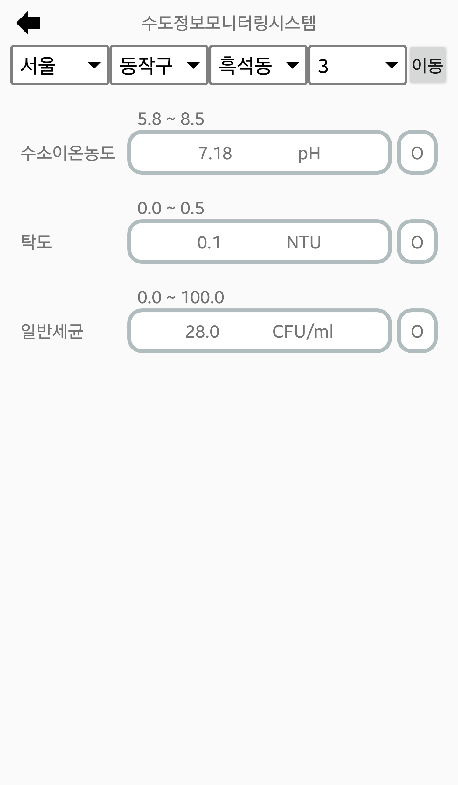
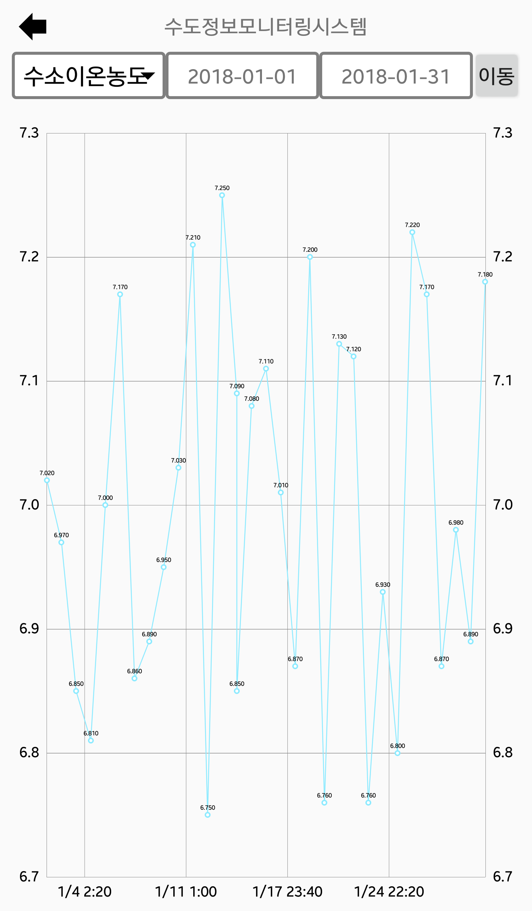
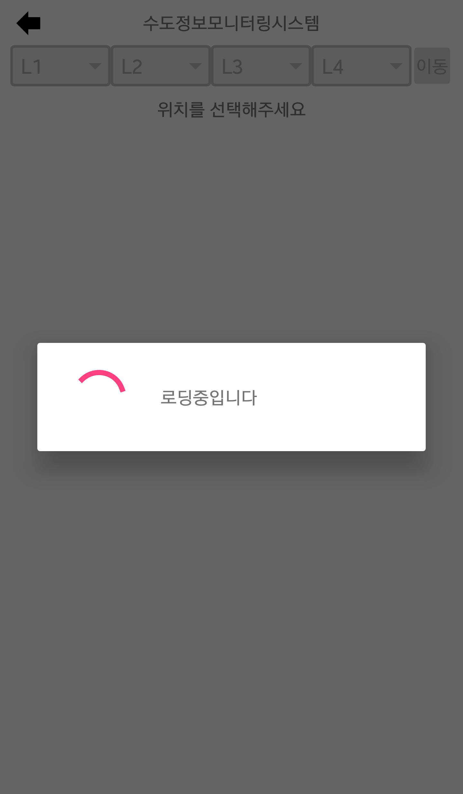
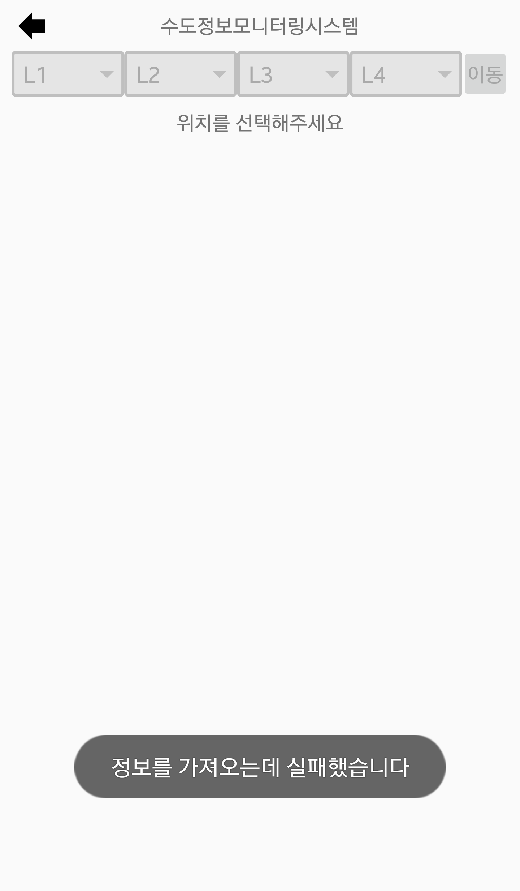

# 애플리케이션 구성 및 구현
## 구성
1. 메인화면

터치하면 다음 화면으로 넘어갑니다.  
(본 화면은 프로젝트 요구사항입니다)

2. 위치 설정

4단계로 위치를 설정하게 되어 있습니다.  
현재 단계를 지정하지 않으면 다음 단계로 넘어갈 수 없도록 했습니다.

모든 단계를 설정하면 종류별로 가장 최근의 데이터를 볼 수 있습니다.

3. 종류 & 기간 설정

조회하고자 하는 데이터를 설정하면 데이터를 조회할 기간을 설정할 수 있습니다.  
데이터를 조회할 기간은 데이터가 존재하는 기간 내로만 선택 가능합니다.

끝 지점이 시작 지점보다 앞설 경우 오류 메시지를 띄웁니다.

기간까지 설정했다면 해당 데이터를 그래프로 볼 수 있습니다.

## 구현
- [MainActivity.java](./TestApplication/app/src/main/java/test/testapplication/MainActivity.java)
  - 처음 실행하면 보게 되는 화면입니다.
  - 터치 이벤트가 발생하면 다음 액티비티로 넘어갑니다.

- [Display1.java](./TestApplication/app/src/main/java/test/testapplication/Display1.java)
  - 두 번째 화면입니다.
  - 위치 선택을 위한 `Spinner`를 포함하고 있습니다.
  - 이전 단계가 선택되지 않았다면 현재 `Spinner`를 비활성화합니다.
    - `Spinner`가 비활성화되어 있음을 알리기 위해 [spinner_background.xml](./TestApplication/app/src/main/res/drawable/spinner_background.xml)에서 `android:state_enabled`라는 속성을 이용하여 비활성화된 경우 배경을 어둡게 처리하였습니다.
  - 모든 `Spinner`를 설정한 뒤 데이터를 요청하면 해당 데이터를 `CriteriaView`에 담아서 보여줍니다.

- [SpinnerUtil.java](./TestApplication/app/src/main/java/test/testapplication/SpinnerUtil.java)
  - 드롭다운 메뉴(`Spinner`)를 위한 클래스입니다.
  - 드롭다운 메뉴 선택 시 힌트를 제공하기 위해 `ArrayAdapter` 클래스를 상속받은 `MySpinnerAdapter` 클래스를 만들었습니다.
    - `getView` 메소드와 `getCount` 메소드를 Override하여 맨 마지막 항목을 메뉴에서 보이지 않도록 하면서 힌트로 제공하도록 만들었습니다.

- [CriteriaView.java](./TestApplication/app/src/main/java/test/testapplication/CriteriaView.java)
  - 두 번째 화면에서 데이터를 표시할 때 여러 번 사용되는 레이아웃을 재사용하기 위한 클래스입니다.

- [Display2.java](./TestApplication/app/src/main/java/test/testapplication/Display2.java)
  - 세 번째 화면입니다.
  - 종류 선택을 위한 `Spinner`를 포함하고 있습니다.
  - 날짜 선택에는 `DatePickerDialog`를 이용하였습니다.
    - `setMinDate`와 `setMaxDate` 메소드를 이용하여 선택할 수 있는 날짜를 데이터가 존재하는 기간으로 제한했습니다.
  - 데이터 요청 시 끝 날짜가 시작 날짜보다 앞서면 오류 메시지를 `Toast`로 띄우도록 했습니다.
  - 데이터를 보여주기 위해 그래프 라이브러리인 `MPAndroidChart`의 `LineChart`를 이용하였습니다. 

- [DayAxisValueFormatter.java](./TestApplication/app/src/main/java/test/testapplication/DayAxisValueFormatter.java)
  - 그래프에서 x축의 데이터가 표시되는 형식을 바꾸기 위해 만들었습니다.
    - 그래프 내부적으로는 x축 데이터를 정숫값인 unix time으로 처리하지만 이를 사람이 알아보기는 쉽지 않으므로, 이 값을 사람이 알아볼 수 있는 형식으로 바꾸기 위해 사용됩니다.

- [NetworkUtil.java](./TestApplication/app/src/main/java/test/testapplication/NetworkUtil.java)
  - 이 앱의 핵심인 네트워크 통신을 위한 유틸리티를 담고 있는 클래스입니다.
  - API를 요청할 주소가 담겨있는 `SERVER_URL` 클래스 변수와 파라미터들을 URL로 변환하는 `urlBuilder` 메소드가 있습니다.
  - 네트워크 요청을 위한 `requestGET` 클래스를 `AsyncTask` 클래스를 상속받아 만들었습니다.
    - API 레벨 11 (Android 3.0) 이상에서는 네트워크 작업을 메인 스레드에서 실행할 수 없고, 당시 스레드를 사용해본 경험이 없어서 이를 쉽게 사용할 수 있는 `AsyncTask`를 사용하였습니다.
    -   
    요청이 진행 중임을 표시하기 위해 `ProgressDialog`를 이용하였습니다.
    -   
    요청이 실패했을 때 `Toast` 메시지를 띄우도록 했습니다.
    - 이와 같은 일련의 과정을 네트워크 요청마다 반복해야 하므로 `AsyncTask` 클래스를 직접 사용하지 않고 이를 상속받는 클래스를 만들었습니다.
    - 이로 인해 요청 시작과 끝에 실행해야 하는 작업을 정의해야 할 필요가 생겨서 `preExecutable`과 `postExecutable` 인터페이스를 제작하였고, 요청 전후에 해당 객체의 `execute` 메소드를 호출하는 방식으로 만들었습니다.